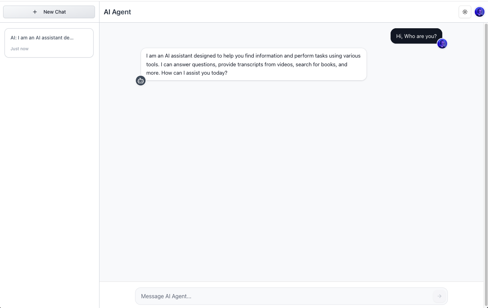

# AI Agent


An advanced AI chat app developed with Next.js, offering real-time messaging, and seamless tool coordination using LangChain and gpt-4o-mini model.

## Tech Stack

- **Frontend Framework:** Next.js 15.2.8
- **UI Library:** React 19.1.0
- **Styling:** Tailwind CSS V4
- **Authentication:** Clerk
- **Database:** Convex
- **AI Integration:** LangChain
- **Icons:** Lucide React & Radix UI Icons
- **Type Safety:** TypeScript

## Before You Get Started

1. [Sign up for a Clerk account](https://clerk.com)
2. [Sign up for a Convex account](https://convex.dev)
3. [Sign up for an IBM Watsonx.ai account](https://wxflows.ibm.stepzen.com)

## Features

- 🤖 Advanced AI chat interface with GPT-4o-mini
- 🎨 Modern and responsive UI with Tailwind CSS
- 🔐 Authentication with Clerk
- 💾 Real-time data storage with Convex
- ⚡ Built with Next.js 15 and React 19
- 🌊 Advanced streaming responses with custom implementation
- 📱 Mobile-friendly design
- 🔧 Intelligent tool orchestration with LangGraph
- 🔄 Real-time updates and tool execution feedback
- 📚 Integration with various data sources via wxflows

## Advanced Features

### AI and Prompt Management

- **Context Window:** Efficient 4096 token context management
- **Tool-Augmented Responses:** Enhanced AI capabilities with custom tools
- **Context-Aware Conversations:** Intelligent conversation management
- **Prompt Caching:** Automatically speeds up responses by caching prompts via OpenAI

### Tool Integration

- **wxflows Integration:**
  - Quick integration of various data sources
  - Support for YouTube transcripts
  - Google Books API integration
  - Custom data source tooling
  - Wikipedia API integration
  - Math API integration

### LangChain & LangGraph Features

- **State Management:** Sophisticated state handling with StateGraph
- **Tool Orchestration:** Advanced tool management with ToolNode
- **Memory Management:** Efficient context tracking with MemorySaver
- **Message Optimization:** Intelligent message trimming and context management

### Streaming Implementation

- **Custom Streaming Solution:**
  - Real-time token streaming
  - Tool execution feedback
  - Error handling for failed tool calls
  - Workarounds for LangChainAdapter limitations

### Real-time Features

- **Live Updates:** Instant message delivery and updates
- **Tool Visualization:** Real-time tool interaction display
- **History Management:** Efficient message history tracking

## Prerequisites

- Node.js (Latest LTS version recommended)
- PNPM package manager or NPM/Yarn
- Clerk account for authentication
- Convex account for database
- OpenAI API key for AI capabilities
- IBM Watsonx.ai account for wxflows integration
- wxflows CLI for tool integration

## Environment Variables

Make sure to create a `.env.local` file in the root of your project and add the following environment variables:

```bash
NEXT_PUBLIC_CLERK_FRONTEND_API=<your-clerk-frontend-api>
CLERK_SECRET_KEY=<your-clerk-secret-key>
CONVEX_DEPLOYMENT=<your-convex-project-development> # Ex: dev:next-lynx-355
NEXT_PUBLIC_CONVEX_URL=<your-convex-url>
OPENAI_API_KEY=<your-openai-api-key>
WXFLOWS_ENDPOINT=<your-wxflows-endpoint>
WXFLOWS_APIKEY=<your-wxflows-apikey>
```

## Installation

1. Clone the repository:

```bash
git clone git@github.com:faridvatani/ai-agent.git
cd ai-agent
```

2. Install dependencies:

```bash
npm install
# or
yarn install
# or
pnpm install
# or
bun install
```

3. Start the development server:

```bash
npm run dev
# or
yarn dev
# or
pnpm dev
# or
bun dev
```

Open [http://localhost:3000](http://localhost:3000) with your browser to see the result.

You can start editing the page by modifying `app/page.tsx`. The page auto-updates as you edit the file.

This project uses [`next/font`](https://nextjs.org/docs/app/building-your-application/optimizing/fonts) to automatically optimize and load [Geist](https://vercel.com/font), a new font family for Vercel.

## Set up a Convex dev deployment

Next, run the following command:

```bash
npx convex dev
```

This will prompt you to log in with GitHub, create a project, and save your production and deployment URLs.

It will also create a `convex/` folder for you to write your backend API functions in. The dev command will then continue running to sync your functions with your dev deployment in the cloud.

## Getting Started with IBM Watsonx.ai Flows Engine

Follow these steps to set up your project using wxflows:

Setup

1. Sign Up & Authenticate: Create a free account, install the CLI for Python or Node.js, and log in to your account.

2. Create a Folder: Create a folder named wxflows.

3. Initialize Project:

```
wxflows init --endpoint=api/ai-agent
```

4. Install Pre-built Tools:
   From the [IBM wxflows tools repository](https://github.com/IBM/wxflows/blob/main/tools/README.md), import tools like Wikipedia, Google books, Math, YouTube Transcript and etc. For example:

```
wxflows import tool https://raw.githubusercontent.com/IBM/wxflows/refs/heads/main/tools/wikipedia.zip
wxflows import tool https://raw.githubusercontent.com/IBM/wxflows/refs/heads/main/tools/youtube_transcript.zip
wxflows import tool https://raw.githubusercontent.com/IBM/wxflows/refs/heads/main/tools/math.zip
wxflows import curl https://dummyjson.com/comments
wxflows import curl https://introspection.apis.stepzen.com/customers
```

5. Deploy the tools:

```
wxflows deploy
```

## Keywords

✅ **LangChain:** A framework for working with large language models (LLMs) that enables the use of tools, conversation history management, and more.<br>
✅ **LangGraph:** A tool for managing conversation flow and states using state graphs (StateGraph).<br>
✅ **systemMessage:** A message that instructs the model on how it should behave (such as guidelines or rules).<br>
✅ **Prompt Caching:** Storing requests and responses to speed up future conversations.

## Learn More

To learn more about Next.js, take a look at the following resources:

- [Next.js Documentation](https://nextjs.org/docs) - learn about Next.js features and API.
- [Learn Next.js](https://nextjs.org/learn) - an interactive Next.js tutorial.

You can check out [the Next.js GitHub repository](https://github.com/vercel/next.js) - your feedback and contributions are welcome!

## Deploy on Vercel

The easiest way to deploy your Next.js app is to use the [Vercel Platform](https://vercel.com/new?utm_medium=default-template&filter=next.js&utm_source=create-next-app&utm_campaign=create-next-app-readme) from the creators of Next.js.

Check out our [Next.js deployment documentation](https://nextjs.org/docs/app/building-your-application/deploying) for more details.
